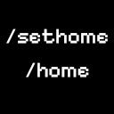

# Home Commands 1.0.1 - [Voxel Core](https://github.com/MihailRis/voxelcore) Content Pack

## Скачать

Мод на [Voxel World](https://voxelworld.ru/mods/home-commands)

## Описание

Небольшой мод который добавляет две простые команды для игры в одиночку и на сервере /sethome и /home (можно изменить по желанию)

## Функционал

Базовый функционал пака представляет собой две просыте команды /sethome и /home, первая сменяет точку дома, вторая телепортирует

Контент пак поддерживает довольно сильную кастомизацию, настройки мода можно найти в его папке по пути config/settings.toml там же можно найти [README.md](./config/README.md) описывающий все настройки и что с ними можно делать

Пак как и было сказано выше поддерживает игру на серверах, и предоставляет функционал для администрации серверах, дальше будет об этих возможностях

```
/sethome [identity] [x] [y] [z]
```

- Админ может изменить точку дома для конкретного игрока(если не указывать координаты, а только identity пользователя, то его точка дома сменится на ваше текущее положение)

```
/home list
```

- Выведет список список всех сохраненных точек домов в формате: **[ identity, x, y, x ]**

```
/home [identity]
```

- Выведет точку дома для одного конкретного пользователя

## Особенности

В одиночной игре следует сначала создать мир и зайти в него, а после добавить контент пак, так не столкнетесь с ошибкой, так же при одиночной игре команда смены точки дома сменяет ещё и spawn point.

Серверные особенности команд не работают для одиночной игры

У смены точки дома есть ограничения по осям X и Z по умолчанию стотысячные координаты

## Зависимости

У пака есть опциональная зависимость в виде пака DaveLogger: [Git](https://github.com/ArtemCmd/DaveLogger) | [Voxel World](https://voxelworld.ru/mods/dave-logger)
